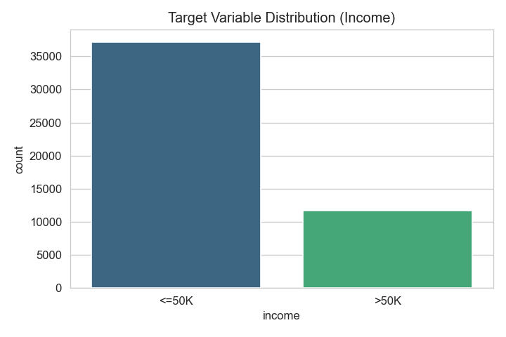
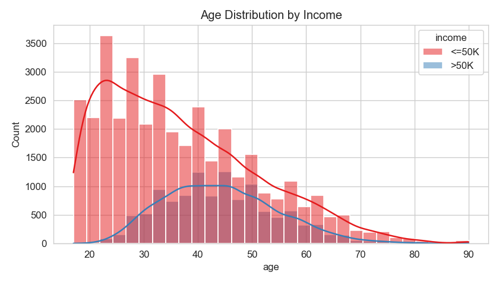
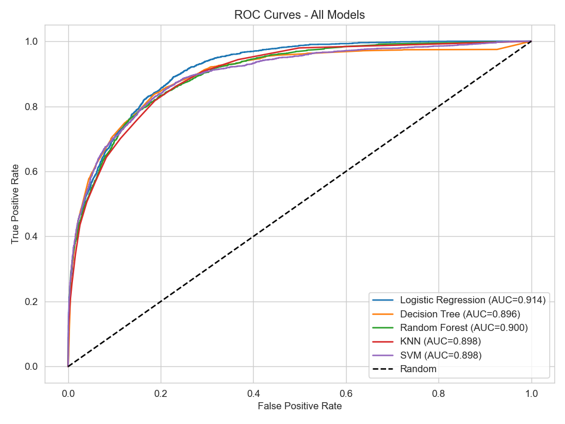
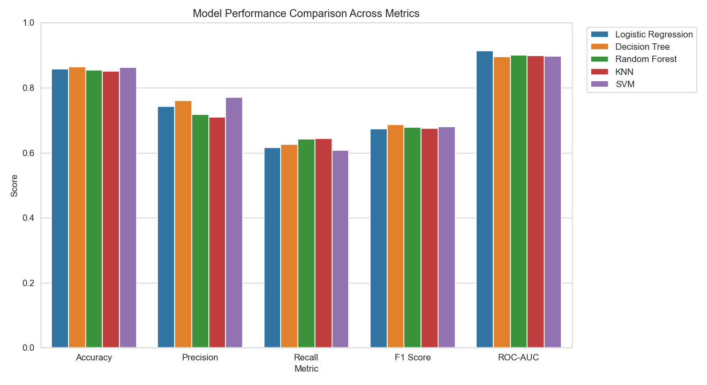

# Adult Census Income — Income Classification

Predicting whether an individual's annual income exceeds **\$50,000** using the
[UCI Adult Census Income](https://archive.ics.uci.edu/dataset/2/adult) dataset.
This is a complete, end-to-end machine learning workflow: data understanding,
cleaning, feature engineering, model building, and evaluation across five
classifiers.

**Author:** Krishna Khajuria

---

## Overview

| | |
|---|---|
| **Task** | Binary classification (`<=50K` vs `>50K`) |
| **Dataset** | 48,842 records, 14 features + target |
| **Models** | Logistic Regression, Decision Tree, Random Forest, KNN, SVM |
| **Best F1** | Decision Tree — **0.6867** |
| **Best ROC-AUC** | Logistic Regression — **0.9144** |
| **Best Accuracy** | Decision Tree — **0.8634** |

---

## Results

| Algorithm | Accuracy | Precision | Recall | F1 Score | ROC-AUC |
|-----------|:--------:|:---------:|:------:|:--------:|:-------:|
| Logistic Regression | 0.8571 | 0.7430 | 0.6164 | 0.6738 | **0.9144** |
| Decision Tree | **0.8634** | 0.7613 | 0.6254 | **0.6867** | 0.8962 |
| Random Forest | 0.8540 | 0.7178 | 0.6426 | 0.6781 | 0.9003 |
| KNN | 0.8518 | 0.7103 | 0.6434 | 0.6752 | 0.8985 |
| SVM | 0.8627 | **0.7701** | 0.6079 | 0.6794 | 0.8977 |

Recall is the limiting metric across all models (~0.61–0.64) because of the
class imbalance (~24% of records are `>50K`).

### Key Figures

| Target distribution | Age by income |
|---|---|
|  |  |

| ROC curves | Metric comparison |
|---|---|
|  |  |

Per-model confusion matrices and the correlation heatmap are in
[`outputs/`](outputs/).

---

## Workflow

1. **Dataset Understanding** — shape, feature types, target distribution, missing values, summary statistics.
2. **Data Cleaning** — removed 52 duplicates, imputed `?` values with column mode, standardized labels, encoded target to binary.
3. **Feature Engineering** — dropped redundant columns (`education`, `fnlwgt`), created `age_group`, `net_capital`, `has_capital_gain/loss`, `hours_category`, `is_us_native`; scaled numeric + one-hot encoded categorical features via a `ColumnTransformer` pipeline.
4. **Model Building** — five classifiers trained on an 80/20 stratified split inside a unified preprocessing pipeline.
5. **Performance Evaluation** — accuracy, precision, recall, F1, and ROC-AUC, plus ROC curves and confusion matrices.

Full details and discussion are in [`REPORT.md`](REPORT.md).

---

## Project Structure

```
adult_census_assignment/
├── adult_income_assignment.py   # End-to-end pipeline (run this)
├── REPORT.md                    # Detailed task-by-task write-up
├── README.md                    # This file
├── requirements.txt             # Python dependencies
├── adult.data                   # Training data (UCI)
├── adult.test                   # Test data (UCI)
└── outputs/                     # Generated plots + performance_comparison.csv
```

---

## How to Run

```bash
# 1. Install dependencies
pip install -r requirements.txt

# 2. Run the full pipeline (regenerates everything in outputs/)
python adult_income_assignment.py
```

All figures and `performance_comparison.csv` are written to the `outputs/` folder.

---

## Conclusion

For this problem, the **Decision Tree** is the best-balanced classifier (highest
F1 and accuracy), while **Logistic Regression** offers the strongest
probabilistic ranking (highest ROC-AUC). Future improvements: address class
imbalance with SMOTE or class weights, and apply hyperparameter tuning to raise
recall on the minority `>50K` class.
